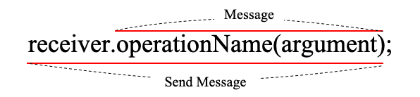
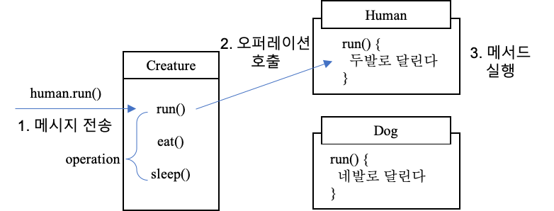

# 메시지와 인터페이스

## 메시지
- 객체들이 협력하기 위해 사용할 수 있는 '유일한' 의사소통 수단이다.



### 메시지와 메서드를 구분하자
- 코드 상에서 동일한 메시지를 전송하더라도 객체의 타입에 따라 실행되는 메서드가 달라질 수 있다.
- 실행 시점(Runtime)에서 응답할 수 있는 객체가 존재하고, 그 객체가 적절한 메서드를 선택하여 응답할 것이라고 믿음
- 장점
    - 메시지에 대한 상세내용을 알 필요없이 메시지만 처리하면 되기 때문에 메시지 전송자와 메시지 수신자가 느슨하게 결합될 수 있다.
    - 메시지 수신자는 메시지를 처리하기 위해 필요한 메서드를 스스로 결정할 수 있는 자율권을 누린다.

### 퍼블릭 인터페이스, 오퍼레이션


- 퍼블릭 인터페이스: 객체가 의사소통을 위해 외부에 공개하는 메시지의 집합
- 오퍼레이션
    - 수행 가능한 어떤 행동에 대한 **추상화**
    - 실행하기 위해 객체가 호출될 수 있는 변환이나 정의에 관한 명세
    - public interface에 포함된 메시지
    - **operation을** 구현하는 부분은 메서드이다.

### 시그니처(signature)
- 오퍼레이션이나 메서드의 명세를 나타낸 것으로 이름과 인자의 목록을 포함

## 훌륭한 인터페이스의 공통적인 특징 4가지 

### 1. 디미터 법칙 (Law of Demeter)
> 낯선 자에게 말하지 말라 <br>
> 오직 인접한 이웃하고만 말하라
- 객체의 내부 구조에 강하게 결합되지 않도록 협력해야 하는 객체를 최소화
- 클래스 내부의 메서드가 메시지를 전송해야 하는 수신자(Receiver)의 조건
    - this 객체 + 메시지
    - 메서드의 매개변수 + 메시지
    - this의 속성 + 메시지
    - this의 속성인 컬랙션의 요소 + 메시지
    - 메서드 내에서 생성된 지역 객체 + 메시지
- shy code: 불필요한 어떤 것도 다른 객체에게 보여주지 않으며, 다른 객체의 구현에 의존하지 않는 코드

#### 캡슐화와 디미터 법칙
- 캡슐화: 클래스 내부의 구현을 감춘다
- 디미터 법칙: 협력하는 클래스의 캡슐화를 지키기 위해 접근해야 하는 요소를 제한한다

### 2. 묻지 말고 시켜라
- 객체에 상태에 관해 묻지 말고 원하는 것을 시키는 메시지를 작성하라

```markdown
> 절차적인 코드는 정보를 얻은 후에 결정한다.
> 객체지향 코드는 객체에게 그것을 하도록 시킨다!
```
- 장점
    - 밀접하게 연관된 정보화 행동을 함께 가지는 객체를 만들 수 있다.
    - 객체의 정보를 이용하는 행동을 객체의 외부가 아닌 내부에 위치시키기 때문에 자연스럽게 정보와 행동을 동일한 클래스 안에 두게 된다.
    - 자연스럽게 정보 전문가에게 책임을 할당하게 되고 높은 응집도를 가진 클래스를 얻을 확률이 높아진다.

### 3. 의도를 드러내는 인터페이스
```text
isSatisfiedByPeriod() -> isSatisfiedBy()
isSatisfiedBySequence() -> isSatisfiedBy()
- '어떻게'가 아니라 '무엇'을 하는지 드러내도록 메서드 이름을 짓자 
```
- 의도를 표현하는 추상적인 인터페이스 뒤로 구현과 관련된 모든 정보를 캡슐화
- 수행 방법에 관해서는 언급하지 말고 '결과'와 '목적'만을 포함하도록 클래스와 오퍼레이션의 이름을 부여하라
- 객체에게 묻지 말고 시키되 구현 방법이 아닌 '클라이언트의 의도'를 드러내야 한다.

#### 1장의 티켓 판매 도메인을 원칙과 기법에 맞춰서 수정해보기
- package chapter1 참

### 4. 명령-쿼리 분리
- 명령(command): 객체의 상태를 수정하는 오퍼레이션
- 쿼리(query): 객체와 관련된 정보를 반환하는 오퍼레이션
- 오퍼레이션은 부수효과를 발생시키는 명령이거나, <br>부수효과를 발생시키지 않는 쿼리 둘 중 하나여야만 한다.
    - 명령 & 쿼리는 안 된다.
- 명령과 쿼리를 분리하기 위한 2가지 규칙
    - 객체의 상태를 변경하는 명령은 반환값을 가질 수 없다.(Setter)
    - 객체의 정보를 반환하는 쿼리는 상태를 변경할 수 없다.(Getter)

#### 예시를 통해 명령-쿼리 분리의 장점 찾기
- pakage schedule 참고

#### 명령-쿼리 분리와 참조 투명성(Referential Transparency)
- "어떤 표현식 e가 있을 때 e의 값으로 e가 나타나는 모든 위치를 교체하더라도 결과가 달라지지 않는 특징"
- 명령이 개입하지 않는 한 쿼리의 값은 변경되지 않기 때문에 쿼리의 결과를 예측하기 쉬워진다.
- 그래서 쿼리들의 순서도 자유롭게 변경할 수 있다.
```text
불변성은 부수효과의 발생을 방지하고 참조 투명성을 만족시킨다.
``` 

## 원칙의 함정
- 객체에게 시키는 것이 항상 가능한 것은 아니다.
- 소프트웨어 설계에 절대적인 법칙은 없다.
- 소프트웨어 설계는 경우에 따라 다르다.
- 원칙이 적절한 상황인지 부적절한 상황인지 판단할 수 있는 안목을 길러라!
 
### 디미터 법칙은 하나의 도트(.)를 강제하는 규칙이 아니다
- 기차 충돌처럼 보이는 코드라도 객체의 내부 구현에 대한 어떤 정보도 외부로 노출하지 않는다면 그것은 디미터 법칙을 준수한 것임

```java
IntStream.of(1, 15, 30, 3, 9).filter(x -> x > 10).distinct().count(); // 쿼리
```

### 결합도와 응집도의 충돌 
- 모든 상황에서 맹목적으로 위임 메서드를 추가하지 말자

```java
// Screening 객체에게 startTime을 묻고 있다.
public class PeriodCondition implements DiscountCondition {
    public boolean isSatisfiedBy(Screening screening) {
        return screening.getStartTime().getDayOfWeek().equals(dayOfWeek) &&
            startTime.compareTo(screening.getStartTime().toLocalTime()) <= 0 &&
            endTime.compareTo(screening.getStartTime().toLocalTime()) >= 0;
    }
}
```
- Screening 객체에게 할인 여부를 판단하는 로직을 옮기면 Screening에 책임이 추가되면서 응집도가 낮아진다.
```java
public class Screening {
    public boolean isDiscountable(DayOfWeek dayOfWeek, LocalTime startTime, LocalTime endTime) {
        return whenScreened.getDayOfWeek().equals(dayOfWeek) &&
            startTime.compareTo(whenScreened.toLocalTime()) <= 0 &&
            endTime.compareTo(whenScreened.toLocalTime()) >= 0;
    }
}
// Screening 객체에 할인 여부 판단의 책임을 위임하고 있음
public class PeriodCondition implements DiscountCondition {
    public boolean isSatisfiedBy(Screening screening) {
        return screening.isDiscountable(dayOfWeek, startTime, endTime);
    }
}
```

## 책임에 초점을 맞춰라 
- 메시지를 먼저 결정하면...
    - 디미터 법칙: 수신할 객체를 알지 못하는 상태에서 메시지를 먼저 선택하기 때문에 객체의 내부 구조에 대해 고민할 필요가 없어진다.
    - 묻지 말고 시켜라: 묻지 말고 시켜라 스타일에 따라 협력을 구조화하게 된다.
    - 의도를 드러내는 인터페이스: 메시지를 전송하는 클라이언트의 관점에서 메시지를 정하기 때문에 당연히 그 이름에 클라이언트가 무엇을 원하는지 의도가 드러난다.
    - 명령-쿼리 분리 원칙: 객체가 어떤 일을 해야 하는지와 협력 속에서 객체의 상태를 예측하고 이해하기 쉽게 하기 위해 명령과 쿼리를 분리하게 된다.
- '계약에 의한 설계'
    - 협력에 필요한 다양한 제약과 부수효과를 명시적으로 정의하고 문서화할 수 있다.
    - 클라이언트 개발자는 오퍼레이션의 구현을 살펴보지 않더라도 객체의 사용법을 쉽게 이해할 수 있다.
    - 계약은 실행 가능하기 때문에 구현에 동기화돼 있는지 여부를 런타임에 검증할 수 있다.
    - 협력을 위해 두 객체가 보장해야 하는 실행 시점의 제약을 인터페이스에 명시할 수 없는 문제를 해결
    - 협력을 위해 클라이언트와 서버가 준수해야 하는 제약을 코드 상에 명시적으로 표현하고 강제할 수 있는 방법